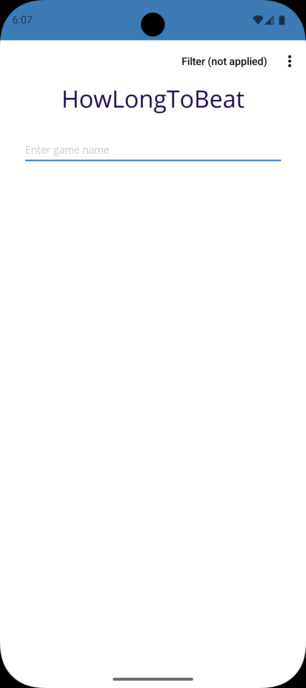
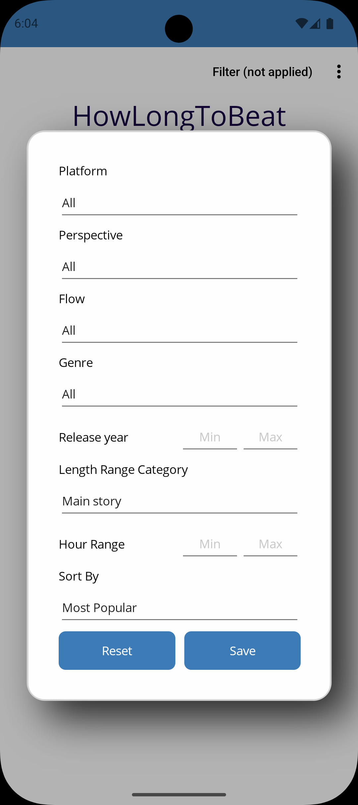
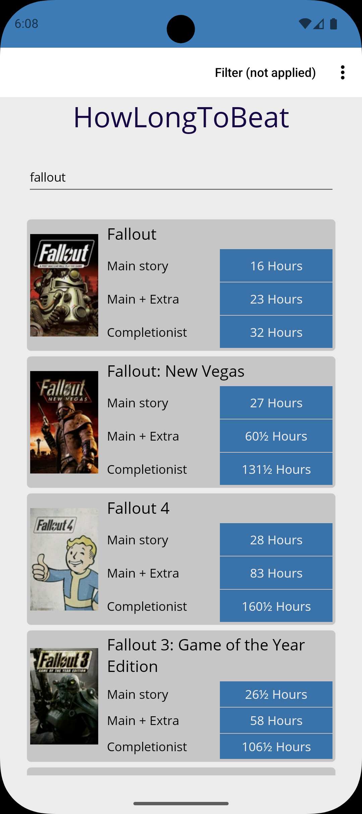

# hltb-android-app-unofficial

Unofficial **How Long To Beat** client for Android.
Search games and view completion times directly from your Android device.

---

## Features

- Search games
- View completion times
- Game cover images

---

## Roadmap

- [ ] Favorites (saved locally for offline access)
- [ ] Search history
- [ ] UI improvements

---

## Screenshots

| Main                    | Details                     | Results                     |
|-------------------------|-----------------------------|-----------------------------|
|  |  | 

---

## Download

Download latest APK from Releases:

https://github.com/mrGoner/hltb-android-app-unofficial/releases

---

## Build from source

Clone repository:

```bash
git clone https://github.com/mrGoner/hltb-android-app-unofficial.git
cd hltb-android-app-unofficial
```

Open solution in Visual Studio / Rider and build Android project.

Or build via CLI:

```bash
dotnet build
```

---
